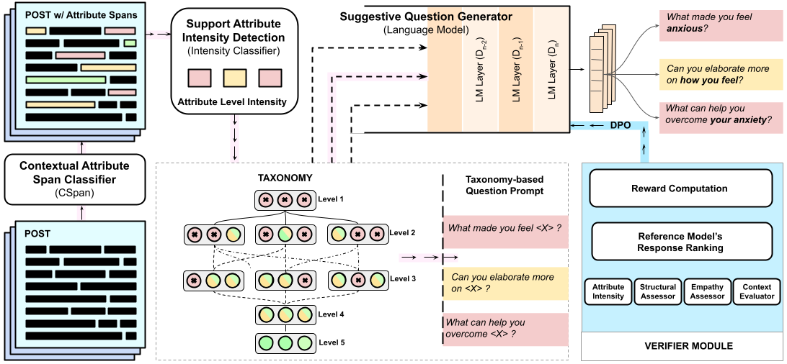

# Assess and Prompt: A Generative RL Framework for Improving Engagement in Online Mental Health Communities

This repository contains the code for the the paper:


- Paper: [Assess and Prompt: A Generative RL Framework for Improving Engagement in Online Mental Health Communities](https://arxiv.org/abs/2508.16788)
- Published in **Findings of EMNLP 2025**  
- Dataset: [REDDME](https://huggingface.co/datasets/Shadowking912/REDDME)

# Abstract



Online Mental Health Communities (OMHCs) provide crucial peer and expert support, yet many posts remain unanswered due to missing support attributes that signal the need for help. We present a novel framework that identifies these gaps and prompts users to enrich their posts, thereby improving engagement. To support this, we introduce REDDME, a new dataset of 4,760 posts from mental health subreddits annotated for the span and intensity of three key support attributes: event what happened?, effect what did the user experience?, and requirement what support they need?. Next, we devise a hierarchical taxonomy, CueTaxo, of support attributes for controlled question generation. Further, we propose MH-COPILOT, a reinforcement learning-based system that integrates (a) contextual attribute-span identification, (b) support attribute intensity classification, (c) controlled question generation via a hierarchical taxonomy, and (d) a verifier for reward modeling. Our model dynamically assesses posts for the presence/absence of support attributes, and generates targeted prompts to elicit missing information. Empirical results across four notable language models demonstrate significant improvements in attribute elicitation and user engagement. A human evaluation further validates the model's effectiveness in real-world OMHC settings.


## Citation

If you use this work, please cite:

```bibtex
@misc{gaur2025assesspromptgenerativerl,
      title={Assess and Prompt: A Generative RL Framework for Improving Engagement in Online Mental Health Communities}, 
      author={Bhagesh Gaur and Karan Gupta and Aseem Srivastava and Manish Gupta and Md Shad Akhtar},
      year={2025},
      eprint={2508.16788},
      archivePrefix={arXiv},
      primaryClass={cs.CL},
      url={https://arxiv.org/abs/2508.16788}, 
}
